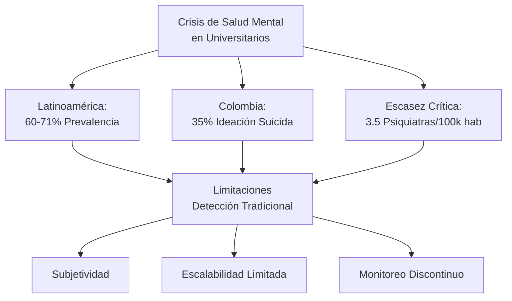
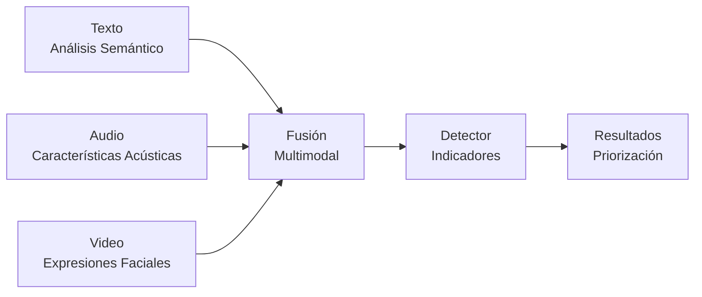
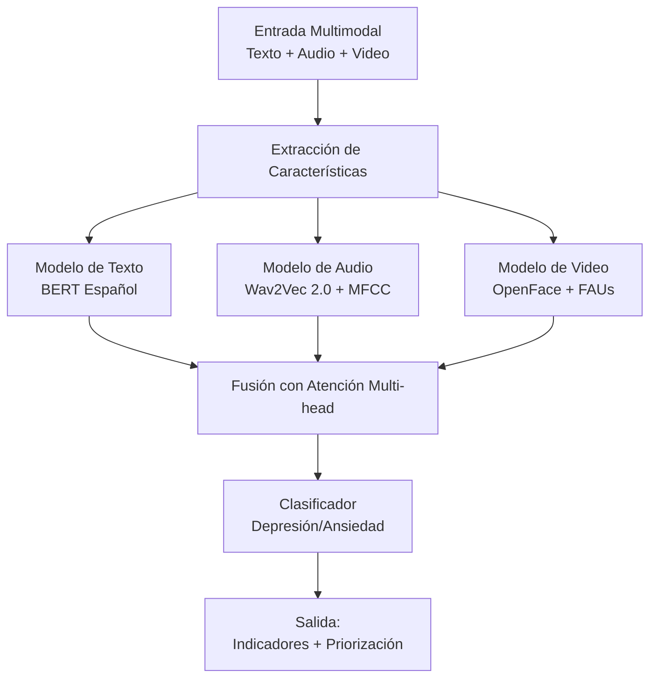
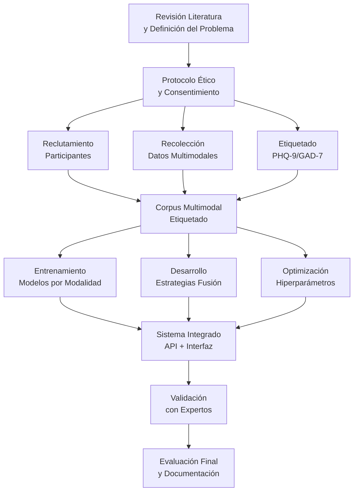
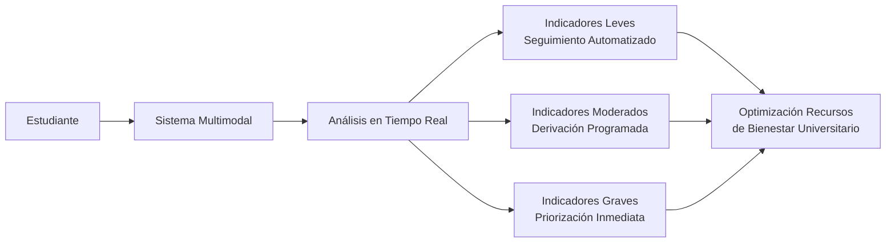
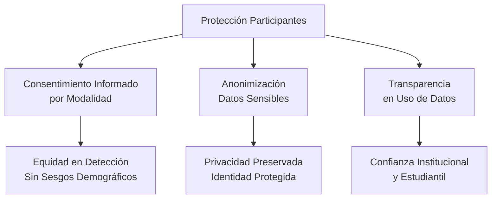

# 🧠 Sistema Multimodal para la Detección Temprana de Depresión y Ansiedad en Población Universitaria

##  Contexto: La Crisis Silenciosa en Educación Superior

La salud mental en el ámbito universitario representa uno de los desafíos más urgentes en el panorama de salud pública contemporáneo. Estudios recientes en Latinoamérica revelan prevalencias alarmantes que superan el 60% en síntomas depresivos y de ansiedad entre estudiantes de educación superior. En Colombia, específicamente, el 35% de jóvenes entre 18 y 26 años reportaron ideación suicida durante la pandemia, con una probabilidad cuatro veces mayor comparada con adultos de mayor edad.

**El problema se agrava** por la escasez crítica de recursos profesionales en salud mental, con solo 3.5 psiquiatras por cada 100,000 habitantes en el país, limitando severamente el acceso a evaluaciones especializadas oportunas.



##  Nuestra Propuesta: Enfoque Multimodal Integrado

Frente a estas limitaciones, desarrollamos un sistema de inteligencia artificial que integra análisis simultáneo de texto, audio y video para la detección temprana de indicadores de depresión y ansiedad. La premisa fundamental es que los trastornos de salud mental se manifiestan de manera heterogénea a través de múltiples canales comportamentales, y la integración multimodal permite capturar esta complejidad de manera más comprehensiva.

**La evidencia científica** respalda este enfoque: estudios recientes demuestran mejoras de hasta 25% en métricas de precisión al integrar modalidades múltiples comparado con sistemas unimodales. Esto se debe a que diferentes modalidades capturan aspectos complementarios de las manifestaciones sintomáticas.



###  Fundamentos Científicos por Modalidad

**Análisis de Texto:** Examina patrones lingüísticos característicos de estados depresivos y ansiosos, incluyendo vocabulario predominantemente negativo, expresiones de autocrítica persistente, y patrones de pensamiento rumiativo. Utilizamos modelos BERT en español fine-tuned para contexto clínico-educativo.

**Procesamiento de Audio:** Captura características paralingüísticas como voz monótona, pausas prolongadas, reducción en la variación tonal, y velocidad del habla disminuida. Implementamos extractores de características acústicas avanzados como MFCC y eGeMAPS combinados con modelos pre-entrenados como Wav2Vec 2.0.

**Análisis Visual:** Detecta cambios en expresiones faciales mediante el seguimiento de Unidades de Acción Facial (FAUs), frecuencia reducida de sonrisas genuinas, expresiones vacías o fruncidas, y patrones de mirada. Empleamos OpenFace para la extracción robusta de biomarcadores visuales.

##  Arquitectura del Sistema

El sistema sigue una arquitectura modular que permite el procesamiento independiente de cada modalidad antes de la integración mediante mecanismos de fusión avanzados. Esta aproximación garantiza que se preserve la información específica de cada canal mientras se capturan las correlaciones inter-modales.

**Proceso de Integración:** Cada modalidad se procesa mediante redes neuronales especializadas, cuyas representaciones se combinan mediante mecanismos de atención multi-head que aprenden dinámicamente la importancia relativa de cada modalidad según el contexto específico y las características individuales del estudiante.



##  Metodología de Desarrollo

El proyecto sigue la metodología de **Design Science Research**, un enfoque iterativo que garantiza el desarrollo sistemático de artefactos tecnológicos con aplicabilidad práctica en dominios específicos. Esta metodología se estructura en cuatro fases principales que guían el proceso desde la identificación del problema hasta la validación final del sistema.

**Característica clave** de este enfoque es su naturaleza iterativa, permitiendo el refinamiento progresivo basado en evaluación empírica continua y retroalimentación de expertos en cada etapa del desarrollo.



### Fase 1: Identificación del Problema
Comprende una revisión sistemática de literatura sobre sistemas multimodales de IA para detección de depresión y ansiedad, utilizando la técnica ProKnow-C para selección y análisis estructurado de bibliografía relevante.

### Fase 2: Definición de Objetivos
Establece los requisitos funcionales y no funcionales del sistema, junto con el diseño arquitectónico detallado que considera aspectos de modularidad, mantenibilidad y adaptabilidad para futuras extensiones.

### Fase 3: Diseño y Desarrollo Iterativo
Se estructura en cuatro iteraciones especializadas:
- **Iteración 1:** Protocolo ético y procesamiento de datos
- **Iteración 2:** Construcción del corpus multimodal
- **Iteración 3:** Desarrollo de modelos de fusión
- **Iteración 4:** Integración y refinamiento del sistema

### Fase 4: Demostración y Validación
Incluye evaluación empírica con datos de prueba, análisis comparativo con métodos del estado del arte, y pruebas de usabilidad con profesionales de salud mental para validar la aplicabilidad práctica.

## 🎓 Aplicación en Contexto Universitario

El sistema está diseñado específicamente para entornos universitarios, considerando las particularidades demográficas, culturales y logísticas de esta población. La implementación se concibe como una herramienta de cribado de primera línea que complementa, no reemplaza, la evaluación profesional especializada.

**Flujo de intervención:** Los estudiantes interactúan con el sistema mediante sesiones breves donde responden preguntas abiertas mientras se capturan sus respuestas en texto, audio y video. El sistema analiza estas señales y genera un perfil de riesgo que permite la priorización inteligente de casos según la severidad de los indicadores detectados.



**Población objetivo inicial:** Estudiantes de Ingeniería de Sistemas y Psicología de la Universidad Tecnológica de Bolívar, con potencial de expansión a otras facultades y instituciones.

## 🔬 Contribución Científica y Técnica

Este proyecto representa varias contribuciones significativas al campo de la detección automatizada de problemas de salud mental:

**Innovación técnica:** Desarrollo de estrategias de fusión multimodal adaptativas que ajustan dinámicamente los pesos de cada modalidad según patrones individuales, superando las limitaciones de enfoques de fusión fijos.

**Contribución de datos:** Creación del primer corpus multimodal en español específicamente para contexto universitario colombiano, etiquetado con escalas validadas (PHQ-9 y GAD-7) y disponible para la comunidad científica.

**Avance metodológico:** Establecimiento de protocolos éticos especializados para recolección y procesamiento de datos multimodales sensibles en entornos educativos.

```mermaid
xychart-beta
    title "Comparación de Precisión entre Enfoques Unimodales y Multimodal"
    x ["Solo Texto", "Solo Audio", "Solo Video", "Multimodal"]
    y [65, 58, 62, 82]
    bar [55, 50, 53, 75]
```

##  Consideraciones Éticas y de Privacidad

El desarrollo del sistema incorpora desde su diseño consideraciones éticas fundamentales para garantizar la protección de los participantes y el uso responsable de la tecnología.

**Consentimiento informado modal:** Diseñamos formularios de consentimiento específicos para cada tipo de dato (texto, audio, video), reconociendo que estas modalidades presentan diferentes niveles de sensibilidad y requerimientos de protección.

**Anonimización robusta:** Implementamos técnicas avanzadas de anonimización que garantizan la protección de la identidad de los participantes mediante eliminación de identificadores personales y ofuscación de atributos sensibles.

**Equidad algorítmica:** Incorporamos mecanismos para mitigar sesgos demográficos y garantizar que el sistema funcione de manera equitativa across diferentes grupos poblacionales.



##  Productos Esperados

El proyecto generará varios productos tangibles que beneficiarán tanto a la comunidad académica como a las instituciones educativas:

| Producto | Descripción | Impacto |
|----------|-------------|---------|
| **Protocolo Ético Multimodal** | Documento con procedimientos para recolección consensuada de datos multimodales, incluyendo formularios de consentimiento específicos por modalidad y protocolos de anonimización verificables. | Establece estándares replicables para investigación responsable con datos sensibles en entornos educativos. |
| **Corpus Multimodal Etiquetado** | Base de datos con muestras de texto, audio y video de estudiantes universitarios, sincronizadas y etiquetadas con escalas PHQ-9 y GAD-7. | Primer recurso de este tipo en español para contexto universitario colombiano, facilitando futuras investigaciones. |
| **Arquitecturas de Fusión Entrenadas** | Modelos de IA implementados y optimizados que incluyen sistemas de fusión temprana, intermedia y tardía, específicamente entrenados para detección de depresión y ansiedad. | Avance el estado del arte en técnicas de fusión multimodal para aplicaciones en salud mental. |
| **Sistema Integrado de Detección** | Plataforma funcional con API para análisis en tiempo real, interfaz de usuario para visualización de resultados, y arquitectura modular escalable para implementación institucional. | Herramienta práctica que puede ser adoptada por servicios de bienestar universitario para optimizar sus recursos. |

##  Equipo de Investigación

**Investigador Principal:**  
Jeison David Jiménez Alvear - Maestría en Ingeniería con Énfasis en Sistemas y Computación, Universidad Tecnológica de Bolívar. Asistente de investigación con experiencia en procesamiento de lenguaje natural y aprendizaje automático.

**Directores:**  
- **Dr. Edwin Puertas:** Arquitecto de Software de Inteligencia Artificial e Investigador en Procesamiento del Lenguaje Natural, con 20 años de experiencia en ámbito académico y profesional. Director de los Programas de Doctorado y Maestría en Ingeniería de la UTB.
- **Dr. Juan Carlos Martínez:** Ingeniero Electrónico, Doctor por la Universidad de Northeastern, Boston. Becario Fulbright-DNP-Colciencias 2007. Investigador y docente en la UTB desde 2004.
- **Dra. Karol Gutiérrez:** Psicóloga, Magister en Neuropsicología y Doctora en Neuropsicología por la Universidad de Salamanca. Especialista en desarrollo de procesos cognitivos y neurociencias aplicadas a la educación.

##  Impacto Esperado

El desarrollo exitoso de este sistema multimodal tiene el potencial de generar impactos significativos en múltiples dimensiones:

**Impacto en Salud Estudiantil:** Detección más temprana y precisa de estudiantes en riesgo, permitiendo intervenciones oportunas que pueden prevenir la progresión de síntomas y reducir casos de crisis de salud mental no atendidas.

**Impacto Académico:** Reducción potencial de deserción académica relacionada con problemas de salud mental, mediante la identificación y apoyo proactivo a estudiantes que experimentan dificultades.

**Impacto Institucional:** Optimización de los limitados recursos de bienestar universitario mediante la priorización inteligente de casos, asegurando que los estudiantes con mayor necesidad reciban atención oportuna.

**Impacto Científico:** Avance del estado del arte en detección multimodal de problemas de salud mental, particularmente en contextos de habla hispana y entornos educativos.

**Impacto Social:** Establecimiento de estándares éticos y técnicos para el uso responsable de inteligencia artificial en aplicaciones sensibles como la salud mental, creando precedentes para futuras iniciativas similares.

---
