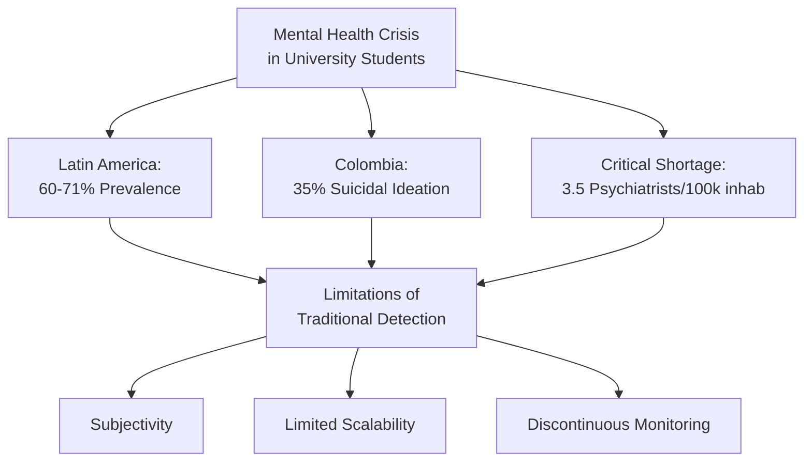
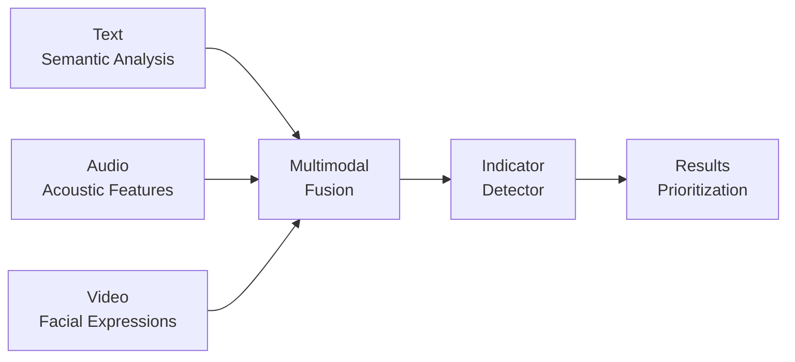
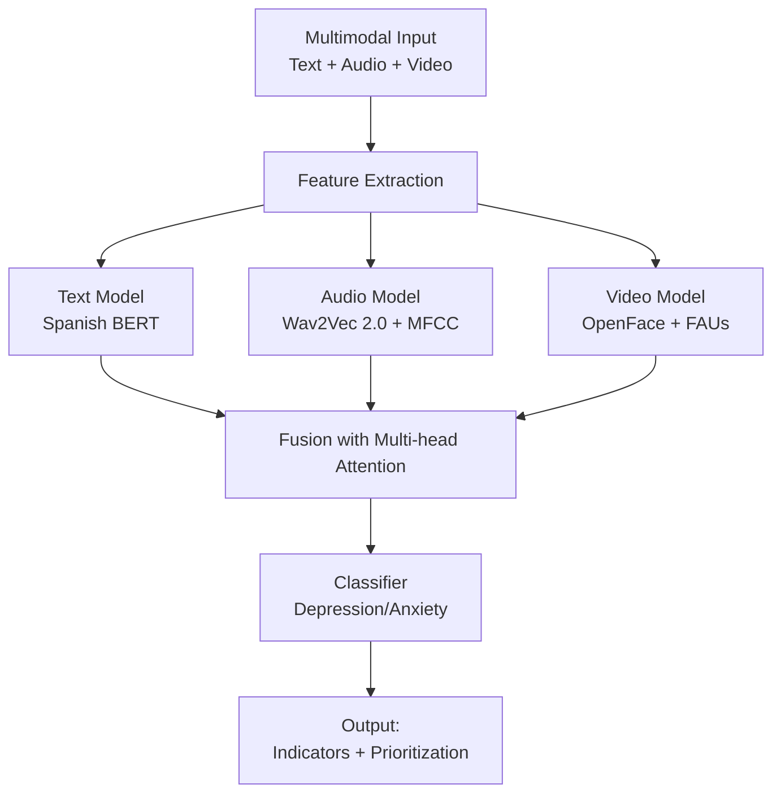
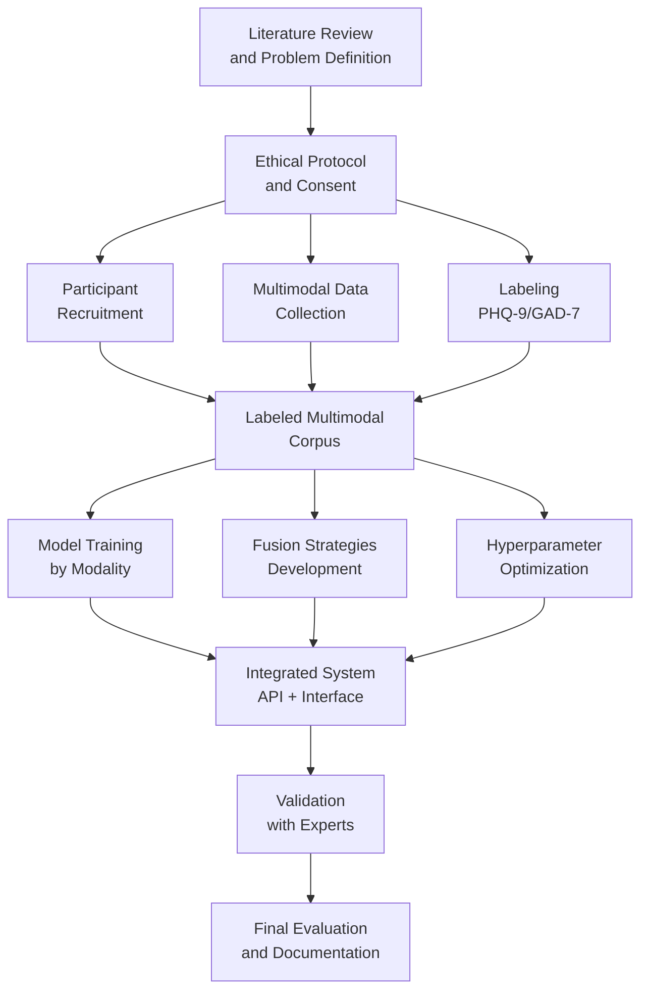
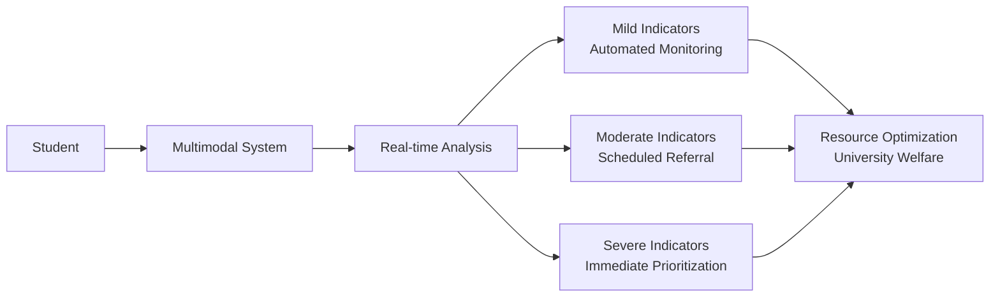
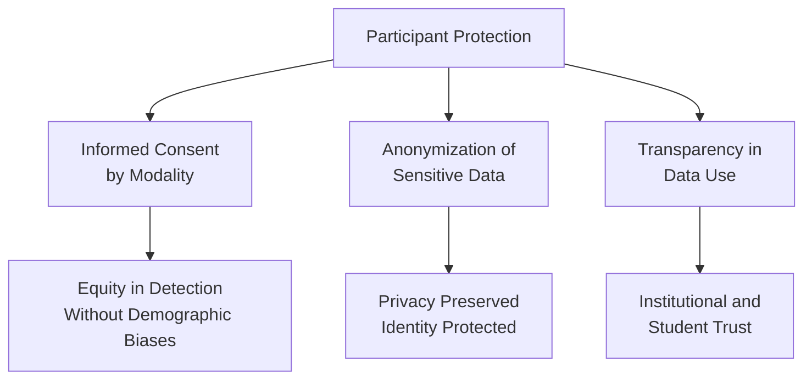

# 🧠 Multimodal System for Early Detection of Depression and Anxiety in University Population

## Context: The Silent Crisis in Higher Education

Mental health in the university setting represents one of the most urgent challenges in contemporary public health. Recent studies in Latin America reveal alarming prevalence rates exceeding 60% for depressive and anxiety symptoms among higher education students. In Colombia specifically, 35% of young people between 18 and 26 years old reported suicidal ideation during the pandemic, with a probability four times higher compared to older adults.

**The problem is aggravated** by the critical shortage of professional mental health resources, with only 3.5 psychiatrists per 100,000 inhabitants in the country, severely limiting access to timely specialized evaluations.



## Our Proposal: Integrated Multimodal Approach

Faced with these limitations, we developed an artificial intelligence system that integrates simultaneous analysis of text, audio, and video for early detection of depression and anxiety indicators. The fundamental premise is that mental health disorders manifest heterogeneously through multiple behavioral channels, and multimodal integration allows capturing this complexity more comprehensively.

**Scientific evidence** supports this approach: recent studies demonstrate improvements of up to 25% in accuracy metrics when integrating multiple modalities compared to unimodal systems. This is because different modalities capture complementary aspects of symptomatic manifestations.



### Scientific Foundations by Modality

**Text Analysis:** Examines linguistic patterns characteristic of depressive and anxious states, including predominantly negative vocabulary, persistent self-critical expressions, and ruminative thinking patterns. We use Spanish BERT models fine-tuned for clinical-educational context.

**Audio Processing:** Captures paralinguistic characteristics such as monotonous voice, prolonged pauses, reduced tonal variation, and decreased speech rate. We implement advanced acoustic feature extractors like MFCC and eGeMAPS combined with pre-trained models like Wav2Vec 2.0.

**Visual Analysis:** Detects changes in facial expressions through tracking of Facial Action Units (FAUs), reduced frequency of genuine smiles, empty or furrowed expressions, and gaze patterns. We employ OpenFace for robust extraction of visual biomarkers.

## System Architecture

The system follows a modular architecture that allows independent processing of each modality before integration through advanced fusion mechanisms. This approach ensures that specific information from each channel is preserved while capturing inter-modal correlations.

**Integration Process:** Each modality is processed through specialized neural networks, whose representations are combined through multi-head attention mechanisms that dynamically learn the relative importance of each modality according to the specific context and individual student characteristics.



## Development Methodology

The project follows the **Design Science Research** methodology, an iterative approach that ensures systematic development of technological artifacts with practical applicability in specific domains. This methodology is structured in four main phases that guide the process from problem identification to final system validation.

**Key characteristic** of this approach is its iterative nature, allowing progressive refinement based on continuous empirical evaluation and expert feedback at each development stage.



### Phase 1: Problem Identification
Comprises a systematic literature review on multimodal AI systems for depression and anxiety detection, using the ProKnow-C technique for structured selection and analysis of relevant bibliography.

### Phase 2: Objective Definition
Establishes the functional and non-functional requirements of the system, along with the detailed architectural design that considers aspects of modularity, maintainability, and adaptability for future extensions.

### Phase 3: Iterative Design and Development
Structured in four specialized iterations:
- **Iteration 1:** Ethical protocol and data processing
- **Iteration 2:** Multimodal corpus construction
- **Iteration 3:** Fusion model development
- **Iteration 4:** System integration and refinement

### Phase 4: Demonstration and Validation
Includes empirical evaluation with test data, comparative analysis with state-of-the-art methods, and usability testing with mental health professionals to validate practical applicability.

## Application in University Context

The system is specifically designed for university environments, considering the demographic, cultural, and logistical particularities of this population. The implementation is conceived as a first-line screening tool that complements, does not replace, specialized professional evaluation.

**Intervention flow:** Students interact with the system through brief sessions where they answer open questions while their responses are captured in text, audio, and video. The system analyzes these signals and generates a risk profile that allows intelligent case prioritization according to the severity of detected indicators.



**Initial target population:** Systems Engineering and Psychology students from Universidad Tecnológica de Bolívar, with potential for expansion to other faculties and institutions.

## Scientific and Technical Contribution

This project represents several significant contributions to the field of automated mental health problem detection:

**Technical innovation:** Development of adaptive multimodal fusion strategies that dynamically adjust the weights of each modality according to individual patterns, overcoming the limitations of fixed fusion approaches.

**Data contribution:** Creation of the first multimodal corpus in Spanish specifically for Colombian university context, labeled with validated scales (PHQ-9 and GAD-7) and available to the scientific community.

**Methodological advancement:** Establishment of specialized ethical protocols for collection and processing of sensitive multimodal data in educational environments.

```mermaid
xychart-beta
    title "Accuracy Comparison Between Unimodal and Multimodal Approaches"
    x ["Text Only", "Audio Only", "Video Only", "Multimodal"]
    y [65, 58, 62, 82]
    bar [55, 50, 53, 75]
```

## Ethical and Privacy Considerations

The system development incorporates from its design fundamental ethical considerations to guarantee participant protection and responsible technology use.

**Modal informed consent:** We design specific consent forms for each data type (text, audio, video), recognizing that these modalities present different sensitivity levels and protection requirements.

**Robust anonymization:** We implement advanced anonymization techniques that guarantee protection of participant identity through elimination of personal identifiers and obfuscation of sensitive attributes.

**Algorithmic equity:** We incorporate mechanisms to mitigate demographic biases and ensure the system functions equitably across different population groups.



## Expected Products

The project will generate several tangible products that will benefit both the academic community and educational institutions:

| Product | Description | Impact |
|----------|-------------|---------|
| **Multimodal Ethical Protocol** | Document with procedures for consensual multimodal data collection, including specific consent forms by modality and verifiable anonymization protocols. | Establishes replicable standards for responsible research with sensitive data in educational environments. |
| **Labeled Multimodal Corpus** | Database with text, audio, and video samples from university students, synchronized and labeled with PHQ-9 and GAD-7 scales. | First resource of its kind in Spanish for Colombian university context, facilitating future research. |
| **Trained Fusion Architectures** | Implemented and optimized AI models including early, intermediate, and late fusion systems, specifically trained for depression and anxiety detection. | Advances state of the art in multimodal fusion techniques for mental health applications. |
| **Integrated Detection System** | Functional platform with API for real-time analysis, user interface for result visualization, and modular scalable architecture for institutional implementation. | Practical tool that can be adopted by university welfare services to optimize their resources. |

## Research Team

**Principal Investigator:**  
Jeison David Jiménez Alvear - Master's in Engineering with Emphasis on Systems and Computing, Universidad Tecnológica de Bolívar. Research assistant with experience in natural language processing and machine learning.

**Directors:**  
- **Dr. Edwin Puertas:** Artificial Intelligence Software Architect and Researcher in Natural Language Processing, with 20 years of experience in academic and professional fields. Director of Doctoral and Master's Programs in Engineering at UTB.
- **Dr. Juan Carlos Martínez:** Electronic Engineer, Doctor from Northeastern University, Boston. Fulbright-DNP-Colciencias Fellow 2007. Researcher and professor at UTB since 2004.
- **Dr. Karol Gutiérrez:** Psychologist, Master in Neuropsychology and Doctor in Neuropsychology from University of Salamanca. Specialist in development of cognitive processes and neuroscience applied to education.

## Expected Impact

The successful development of this multimodal system has the potential to generate significant impacts in multiple dimensions:

**Impact on Student Health:** Earlier and more accurate detection of at-risk students, allowing timely interventions that can prevent symptom progression and reduce cases of unattended mental health crises.

**Academic Impact:** Potential reduction of academic dropout related to mental health problems, through identification and proactive support of students experiencing difficulties.

**Institutional Impact:** Optimization of limited university welfare resources through intelligent case prioritization, ensuring students with greatest need receive timely attention.

**Scientific Impact:** Advancement of state of the art in multimodal detection of mental health problems, particularly in Spanish-speaking contexts and educational environments.

**Social Impact:** Establishment of ethical and technical standards for responsible use of artificial intelligence in sensitive applications like mental health, creating precedents for similar future initiatives.
